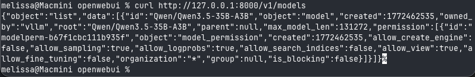
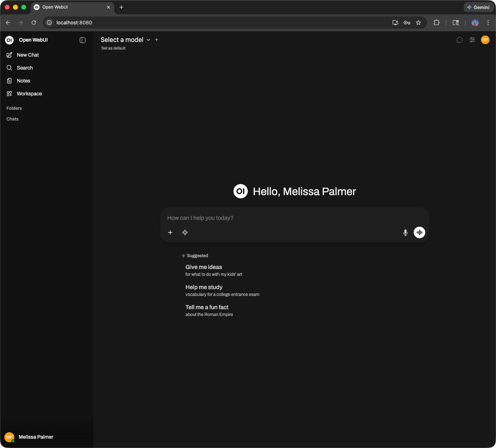
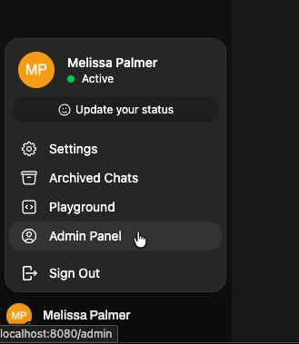
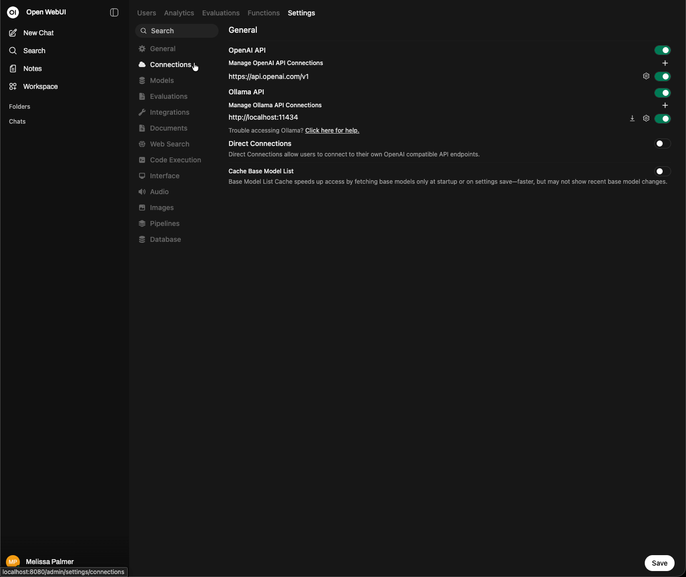
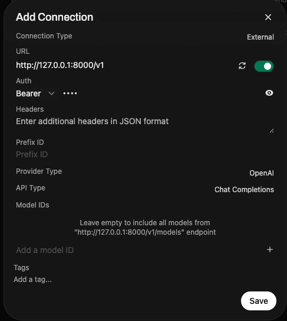
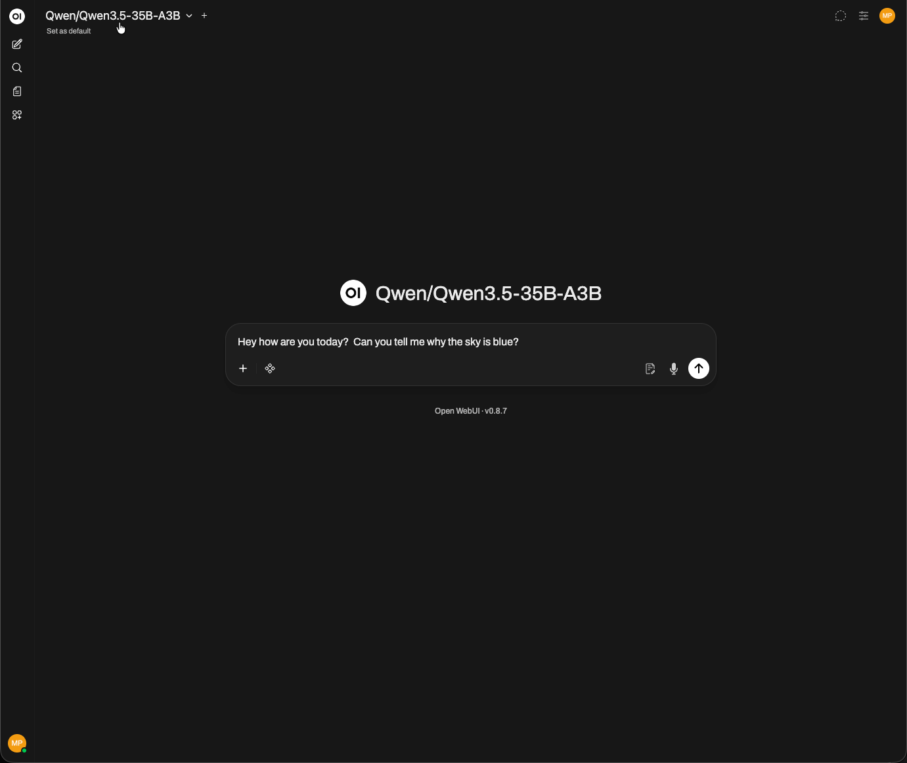
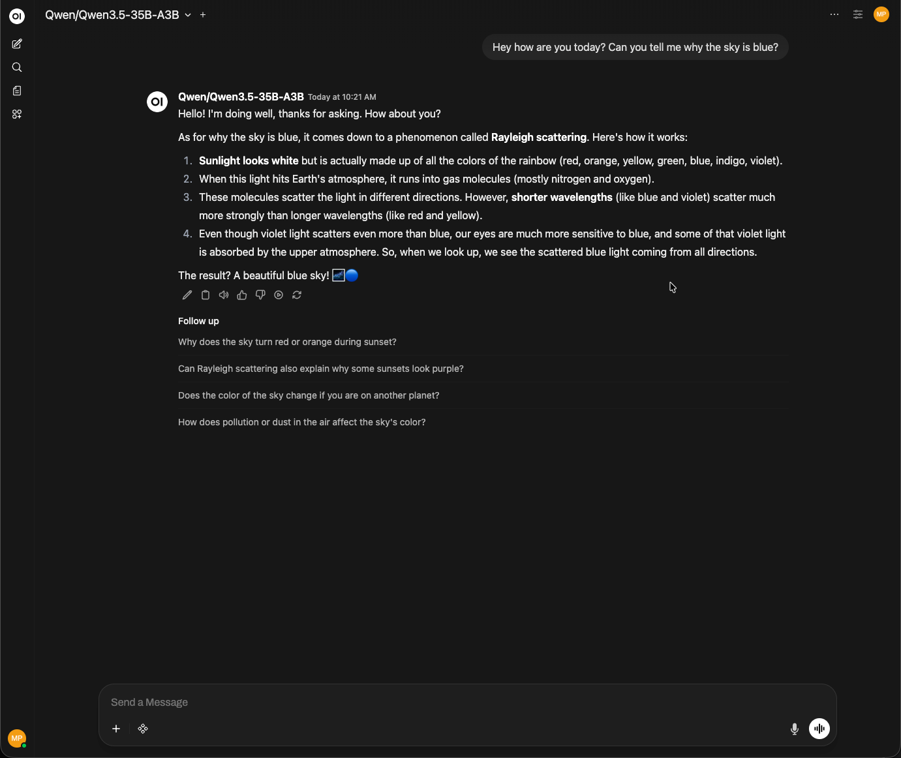
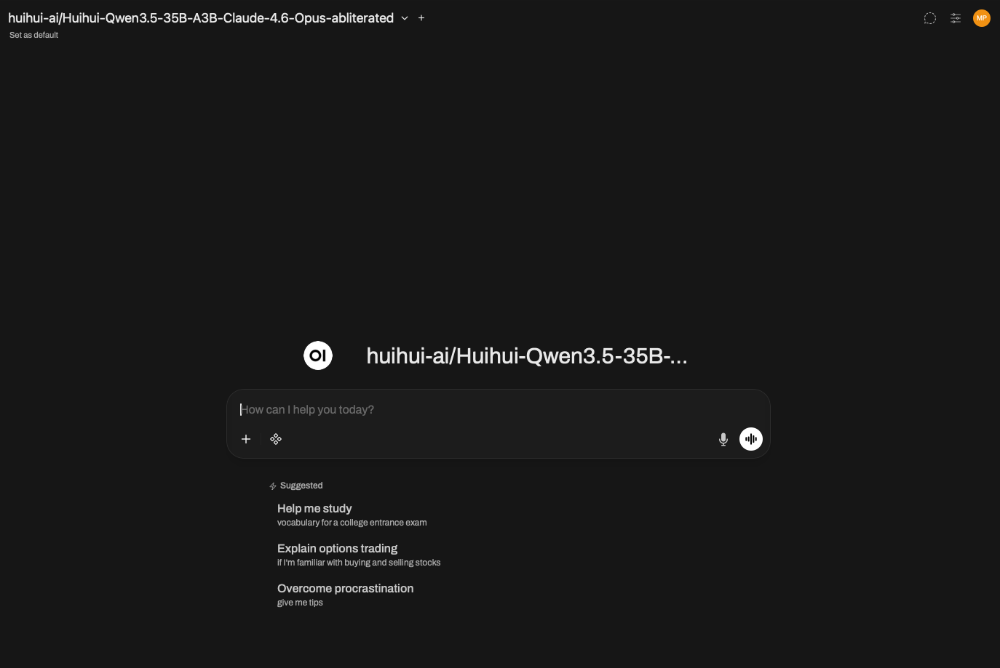

Title: Creating Your Own ChatXYZ Powered by Hot Aisle and Open WebUI
Slug: chatxyz-openwebui-hotaisle
Publish: Yes
Meta Title: Creating Your Own ChatXYZ Powered by Hot Aisle and Open WebUI
Meta Description: Step-by-step guide to building a private ChatGPT-style interface using Open WebUI connected to a self-hosted vLLM server on Hot Aisle. Includes SSH tunneling and architecture overview.
Meta Keywords: Hot Aisle, vLLM, Open WebUI, AMD MI300X, ROCm, self-hosted LLM, inference, SSH tunnel, GPU
Author: Melissa PalmerDate: 03/17/2026
Description: A practical guide to building a private ChatXYZ style environment using Open WebUI and a self-hosted vLLM instance on Hot Aisle. Covers architecture, SSH tunneling, and connecting a local interface to GPU-hosted inference.
Featured: No
Tags: GPU, vLLM, Open WebUI, ROCm, Inference

# Creating Your Own ChatXYZ Powered by Hot Aisle and Open WebUI

Running large language models on your own infrastructure provides greater control over data, model selection, and experimentation.

In this guide we will build a private ChatXYZ-style environment using Open WebUI connected to a model running on Hot Aisle GPU infrastructure.

## Introduction

Running large language models privately is becoming a priority for many organizations. Whether the concern is data privacy, regulatory compliance, cost control, or simply experimentation, enterprises increasingly want the ability to run modern models on their own GPU infrastructure rather than relying exclusively on hosted APIs.

Hot Aisle provides an ideal environment for this type of experimentation. With direct access to modern GPU hardware, it becomes possible to deploy high-performance inference stacks in minutes and run models that would otherwise require expensive managed services.

In this guide we will build a complete private AI inference environment using a Hot Aisle GPU VM. The system will run the **Qwen 3.5 35B model using vLLM**, expose an **OpenAI-compatible API**, and connect to a **local Open WebUI interface** that provides a familiar ChatGPT-style experience.

The architecture we will deploy has three key goals:

• **Performance** — run a large model efficiently using vLLM on GPU hardware

• **Privacy** — keep the inference endpoint private and inaccessible from the public internet

• **Compatibility** — expose a standard OpenAI-style API that works with existing tools

Instead of opening inference ports publicly, we will access the model through an **SSH tunnel**, ensuring that all communication between your machine and the GPU server is encrypted and private.

By the end of this guide you will have a working system that looks and behaves like a private ChatGPT instance, but runs entirely on infrastructure you control. This same pattern is widely used in enterprise environments for secure AI development and can easily be extended with additional models, authentication layers, or retrieval pipelines.

While this guide focuses on a single model and a simple chat interface, the same architecture can be used as the foundation for much larger AI systems.  Many enterprise AI platforms follow this same pattern: GPU-hosted inference, an OpenAI-compatible API layer, and a separate user interface or application layer.

Once this structure is in place, it becomes straightforward to add additional models, integrate retrieval pipelines, connect external applications, or build custom AI tools on top of the same inference infrastructure.

## **Architecture Overview**

The architecture in this guide separates the user interface from the model runtime.

Your browser interface runs locally using Open WebUI, while the model itself runs on a GPU VM hosted on Hot Aisle. Communication between the two happens through a secure SSH tunnel.

This allows the GPU infrastructure to remain private while still providing a responsive local chat interface.

The architecture looks like this:

Your Laptop
   │
   │  Open WebUI (browser interface)
   │
   │  SSH Tunnel
   ▼
Hot Aisle GPU VM
   │
   │  vLLM inference server
   │
   │  Qwen 3.5 35B model
   ▼
OpenAI-compatible API

In this setup:

• The **model runtime** runs on the Hot Aisle GPU VM

• The **chat interface** runs locally on your machine

• The **SSH tunnel** keeps the inference endpoint private

This pattern is widely used for secure internal AI development environments.

Each piece serves a specific purpose.

## Why This Stack

This guide uses four core components to build a private AI environment.

| **Component** | **Role**                          |
| ------------- | --------------------------------- |
| Hot Aisle     | Provides GPU infrastructure       |
| vLLM          | High-performance inference server |
| Qwen 3.5 35B  | Large open-weight language model  |
| Open WebUI    | ChatGPT-style interface           |

**Hot Aisle** provides direct access to modern GPU hardware without needing to build a physical GPU server.

**vLLM** acts as the inference engine. It efficiently manages model execution, handles batching of requests, and exposes a standard OpenAI-compatible API endpoint.

**Qwen 3.5 35B** is a strong open model that performs well across reasoning and general tasks while still fitting comfortably on large-memory GPUs such as the MI300X.

**Open WebUI** provides a polished browser interface that feels similar to ChatGPT while allowing you to connect to your own models.

Together, these components create a flexible private AI environment where models can be swapped, upgraded, or replaced without changing the user interface.

## Install Open WebUI

Open WebUI is an open-source web interface for interacting with large language models through a browser.

In this guide, **Open WebUI will run locally on your machine**, while the model itself will run on a GPU VM hosted on Hot Aisle. The interface will connect to the model through the OpenAI-compatible API exposed by vLLM.

Open WebUI provides a Chat-style user experience while allowing users to connect to their own inference backends, such as vLLM, Ollama, or other OpenAI-compatible APIs. Instead of relying on hosted AI services, Open WebUI acts as a local gateway that lets you chat with privately hosted models, manage multiple models, store conversation history, and configure connections to different inference servers.

Because it supports the standard OpenAI API format, it integrates easily with modern inference engines and makes it simple to build a private AI environment where the user interface runs locally while the actual model execution happens on dedicated GPU infrastructure.

Before continuing with this guide, **install Open WebUI locally and start it**. Once it is running, you should be able to access the interface in your browser.

You can find Open WebUI and the official installation instructions here:

https://github.com/open-webui/open-webui

What is even better about Open WebUI is that it goes well beyond a simple custom web interface. While building your own tools can be a great learning experience, there comes a point where supportability becomes important for production-grade systems. Open WebUI provides a well-maintained interface that makes it easy to manage and interact with privately hosted models.

Open WebUI for Enterprise is also a strong option if you are looking to build a more complete private AI stack.

## **Start a Model on Hot Aisle**

The next step is to start a model on Hot Aisle. In this example, I’ll be using **Qwen3.5-35B-A3B set to non-thinking mode**.

Model choice is an important part of any private AI deployment. Qwen 3.5 35B is a strong open-weight model with good reasoning ability and efficient inference performance. The 35B size also allows multiple concurrent users on GPUs with large VRAM such as the MI300X.

The Hot Aisle VM used in this guide includes a **single MI300X GPU with 192GB of VRAM**. Large GPU memory capacity is important because VRAM is consumed by two primary factors:

1. **Model weights**
2. **KV cache used for active conversations**

Model weights occupy a fixed amount of GPU memory once the model is loaded. The KV cache, however, grows dynamically as users interact with the model and additional context must be stored for each conversation.

Because of this, GPU memory must be large enough to hold both the model and the KV cache for active users. GPUs like the MI300X make it possible to run larger models such as 35B while still supporting multiple concurrent users. Depending on context length and workload characteristics, a single MI300X can support a high level of concurrent usage, think in the hundreds of users range.

Depending on context length and workload characteristics, a single MI300X can support a high level of concurrent usage.

For experimentation and internal tools, this provides a strong balance between model capability and infrastructure cost.

## **Model Selection**

In this guide I run **Qwen 3.5 35B in non-thinking mode using vLLM**. vLLM is designed for high-performance inference and exposes a standard **OpenAI-compatible API**, which makes it easy to connect external tools and user interfaces.

To deploy the model on the Hot Aisle VM, I used **cloud-init**. Cloud-init allows a VM to automatically configure itself at boot, installing dependencies and starting the inference stack without requiring manual setup.

Hot Aisle provides a set of cloud-init templates that can be used as a starting point:

https://github.com/hotaisle/cloud-init-templates

I maintain my own fork of this repository where I store templates I have tested, including the template used in this guide:

https://github.com/vmiss33/cloud-init-templates/tree/master

The template used for this deployment launches **vLLM inside a Docker container** and loads the Qwen 3.5 35B model in non-thinking mode:

https://github.com/vmiss33/cloud-init-templates/blob/master/vllm-docker-qwen35-non-thinking.yaml

When the VM boots, the template automatically installs Docker, starts the vLLM container, downloads the model, and launches the inference server. Once the VM finishes starting, the model is ready to accept requests on port **8000** through an OpenAI-compatible API endpoint.

## Connect Open WebUI to Your Model on Hot Aisle

After you have deployed your model on Hot Aisle, create a ssh tunnel to the Hot Aisle VM:

`ssh -N -L 8000:localhost:8000 hotaisle@x.x.x.x`

where x.x.x.x is the IP of your Hot Aisle VM.

To verify your model is running and your SSH tunnel is working, you can send a simple curl request

`curl http://127.0.0.1:8000/v1/models`

You will see similar output to the following, this lets you know the model that is running, as well as the parameterfs it running with.

If you have not already started Open WebUI start it and log in.

Next, we are going to connect to our model on Hot Aisle.  Click your name in the bottom left corner of the UI, and select Admin Panel.

Then, select Settings from the top menu, then Connections.

Click the + button next to Manage OpenAI API connections.  Add http://127.0.0.1:8000/v1 to the URL, and enter anything in the Bearer field under Auth.

That's it.  Open WebUI will show the model you have running in the corner, and you can begin interacting with the UI.

As you can see, the model is responding correctly through Open WebUI, confirming that the SSH tunnel, vLLM inference server, and OpenAI-compatible API are all working together as expected.

That’s all there is to it. You now have a fully functioning **private ChatXYZ environment** running on your own infrastructure.

In this guide we deployed a modern open-weight model on a Hot Aisle GPU VM using **vLLM**, exposed it through an **OpenAI-compatible API**, and connected it to a local **Open WebUI interface** through a secure SSH tunnel. The result is a private ChatGPT-style experience where the model runs entirely on infrastructure you control.

One of the biggest advantages of this architecture is flexibility. If you deploy a different model to your Hot Aisle VM, Open WebUI will automatically detect it once the SSH tunnel is active. This makes it easy to experiment with new models, test different capabilities, or run specialized models for different workloads.

As open-weight models continue to improve, architectures like this make it possible to build powerful AI systems without relying on external APIs. With access to GPU infrastructure and tools like vLLM and Open WebUI, you can quickly deploy private AI environments tailored to your own needs.

