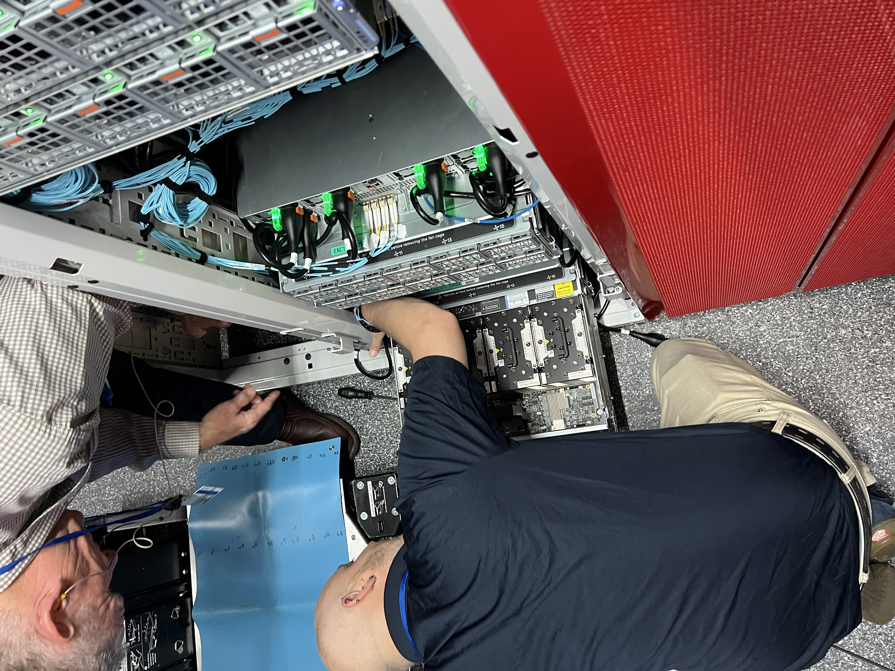
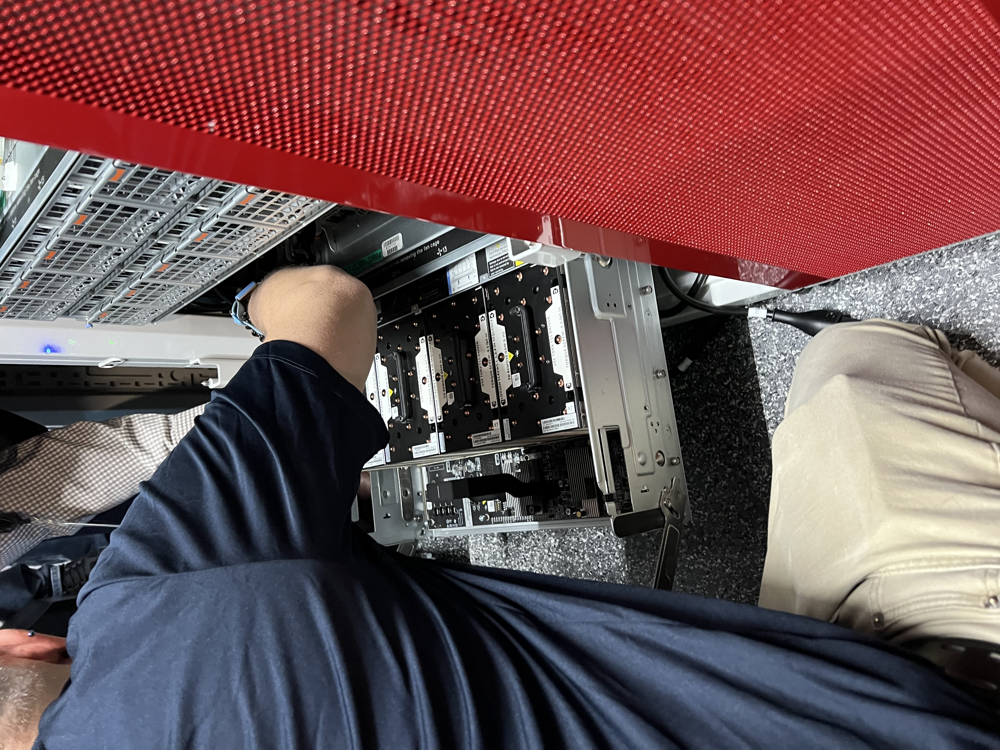
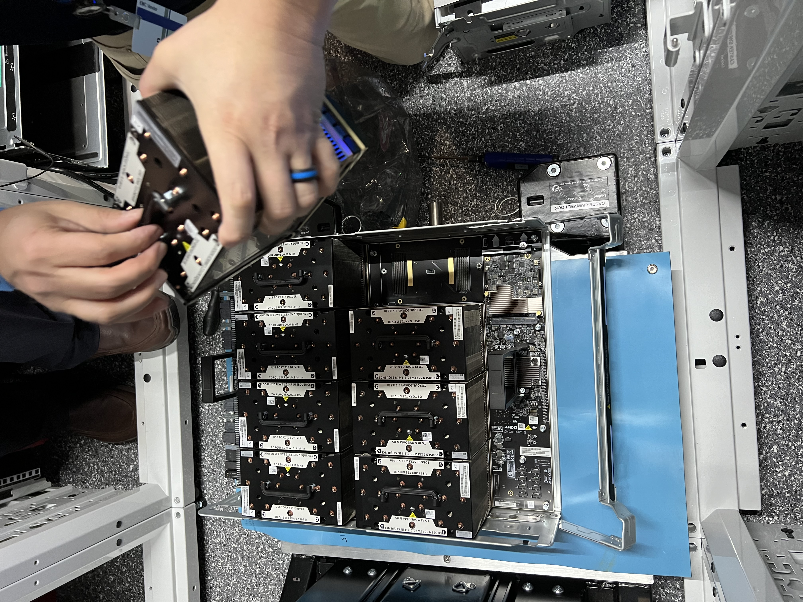
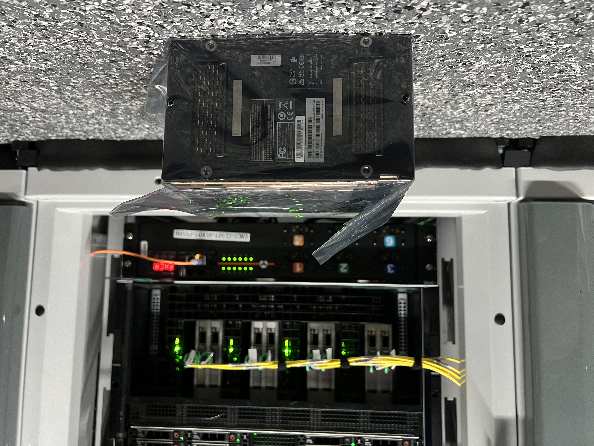
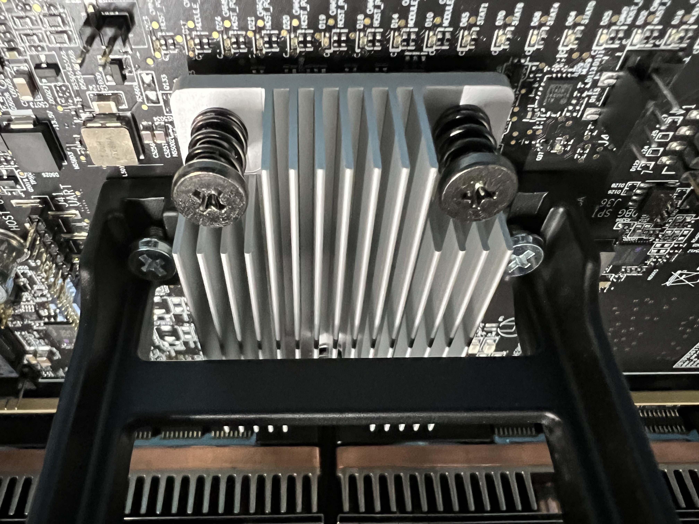
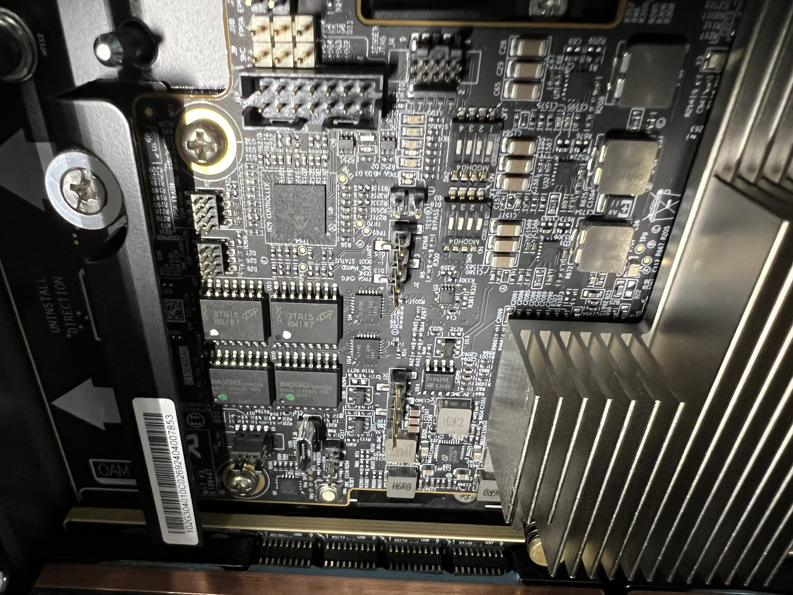
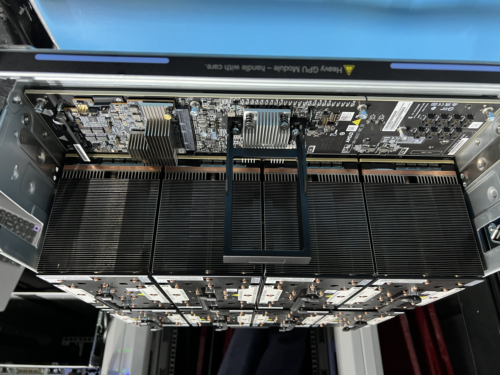
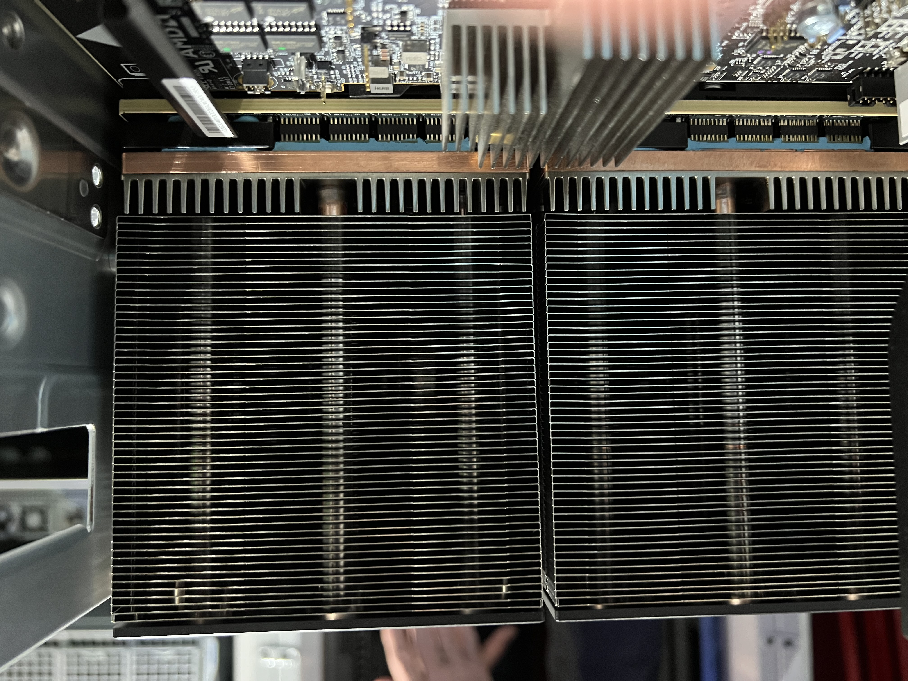

# Cruising to the finish line

Slug: cruising-to-the-finish-line
Publish: Yes
Meta Title: Hot Aisle: Cruising to the finish line
Meta Description: Cruising to the finish line of our deployment
Meta Keywords: super, computer, gpu, mi300x, dell, amd, advizex
Author: Jon Stevens
Date: 09/13/2024
Description: Cruising to the finish line
Featured: No
Tags: Features

## Introduction

---

After a bit more than a week, we have fully deployed our own high-performance super computing cluster. Now we are busy validating that everything works, checking network connections, and replacing parts that are dead on arrival.

We expect the testing, validation and a bit of internal setup and configuration automation to continue for another week or two and then we will be ready to onboard customers full time. Build it and they will come, right?

I’ve also been busy building out this blog, so that we can communicate our journey here instead of on third party websites. One thing you’ll notice is that like the rest of our website, it conveys a personal / human touch. We might use AI to help with grammar, but we won’t be publishing AI generated nonsense bric-a-brac. If you’re using AI to generate content to direct people to your website, why would you waste their time once they got there?

## We are nearly there

---

In this case, it appears as though one of the AMD MI300x GPUs went crazy and had a few loose screws. Dell immediately sent two technicians out to diagnose and fix it. The level of support they are giving us is breathtaking.

Holding this technology in your hands, its weight conveys its value.

[https://youtu.be/xVNIRBn7ru8](https://youtu.be/xVNIRBn7ru8)