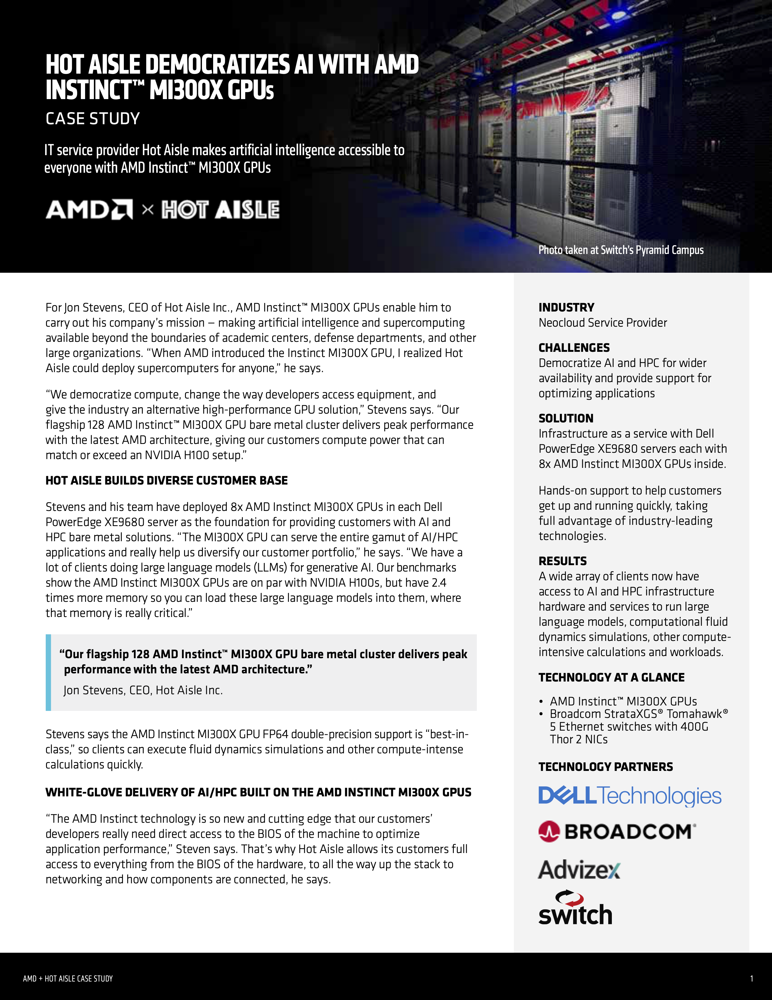
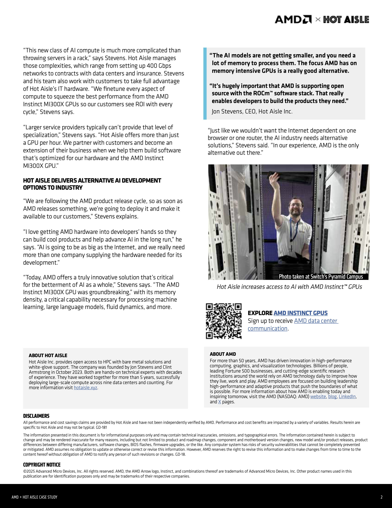

# HOT AISLE DEMOCRATIZES AI WITH AMD INSTINCT™ MI3OOX GPUs

Slug: hot-aisle-democratizes-ai-with-amd-instinct-mi300x-gpus
Publish: Yes
Meta Title: Hot Aisle partners with AMD to democratize AI and HPC, delivering MI300X GPU-powered infrastructure accessible for diverse computing workloads.
Meta Description: Hot Aisle democratizes AI with AMD MI300X GPU clusters.
Meta Keywords: Hot Aisle, AMD, MI300X, GPUs, AI, HPC, Dell, compute, democratization, infrastructure, partnership
Author: Jon Stevens
Date: 04/20/2025
Description: Hot Aisle partners with AMD to democratize AI and HPC, delivering MI300X GPU-powered infrastructure accessible for diverse computing workloads.
Featured: No
Tags: Features

# **Hot Aisle and AMD Democratize AI with New Collaboration**

We're thrilled to announce our latest collaboration with AMD, showcased in our new joint case study highlighting how Hot Aisle is making AI and high-performance computing (HPC) accessible to everyone with AMD Instinct™ MI300X GPUs.

Through our partnership, we have successfully deployed Dell PowerEdge XE9680 servers, each equipped with eight AMD Instinct MI300X GPUs, enabling businesses of all sizes to harness advanced computing power. This infrastructure opens doors previously exclusive to academic institutions and large organizations, providing unparalleled access to cutting-edge technology.

Our flagship offering—a 128 AMD Instinct MI300X GPU bare-metal cluster—delivers industry-leading performance and extensive memory capacity. This setup is perfect for diverse applications such as generative AI, computational fluid dynamics, and large language models, rivaling or exceeding competitive solutions.

Hot Aisle doesn’t just provide hardware; we deliver comprehensive support, including direct BIOS access and infrastructure optimization. By working closely with our customers, we ensure maximum performance and efficiency from each GPU cycle.

We believe strongly in an open, competitive AI landscape. AMD’s commitment to open-source ROCm software aligns perfectly with our mission to empower developers and businesses alike.

Together, we're shaping a more inclusive future for artificial intelligence.

